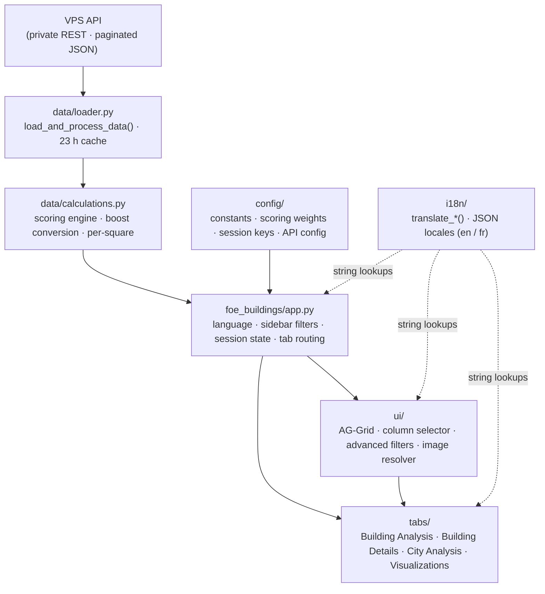

# FoE Buildings Database

A Streamlit web app for analysing and comparing buildings from Forge of Empires. Players use it to rank buildings by efficiency based on their personal city context (daily production, boost percentages) and playstyle weights.

## Quick Start

With `uv` (recommended):

```bash
uv run streamlit run app.py
```

Or with pip:

```bash
pip install -r requirements.txt
streamlit run app.py
```

The app requires API credentials in `.streamlit/secrets.toml`:

```toml
[foe_api]
url = "https://your-subdomain.duckdns.org"
key = "foe_your_api_key_here"
```

Building data is served from a private VPS REST API (not local files). Without valid credentials the app will not start.

## Features

### Home Tab
- AG-Grid table with heatmap colour-coding and sorting
- Filter by era, event, building name, or advanced AND/OR conditions
- Per-square mode: all numeric columns divided by tile count
- Column selector: pick any combination of columns, or apply presets
- Export filtered view as CSV or JSON

### Weights Tab
- Assign point values to each production type (FP, goods, military units, army bonuses, …)
- Enter your current daily production and boost percentages for accurate boost-building valuation
- Scores update live — return to Home to see Weighted Efficiency and Total Score columns

### City Analysis Tab
- Import your inventory and city layout from Forge of Empires with FoE Helper installed (TSV paste)
- Ranks owned buildings by their contribution to your city's scoring
- Era-aware: each building is evaluated at the era it was placed

### Visualizations Tab
- Production charts (bar, scatter, radar)
- Side-by-side building comparison
- Greedy building placement optimiser: given a tile budget, finds the highest-scoring combination

### Analysis Subtabs (Advanced Mode)
- **Consumables**: rank buildings by finish-kit or instant-supply production, with a frequency-format toggle (units/day ↔ days/unit)
- **QI Boosts**: rank buildings by Quantum Incursion bonuses

## Languages

English and French. Building names fall back to English when a French translation is not available.

## Project Structure

```
app.py                               — Entry point; calls foe_buildings.app.main()
foe_buildings/
├── app.py                           — Orchestrator: page config, sidebar, tab routing
├── config/
│   ├── api.py                       — Logging setup, get_api_config(), file path constants
│   ├── constants.py                 — ERAS_DICT, COLUMN_GROUPS, column name constants
│   ├── scoring.py                   — WEIGHTABLE_COLUMNS, BOOST_TO_BASE_MAPPING, WEIGHT_PRESETS
│   └── session.py                   — SessionKeys class, init_session_state()
├── data/
│   ├── loader.py                    — VPS API client, load_and_process_data() (23 h cache)
│   └── calculations.py              — Scoring engine: boost algorithm, weighted efficiency
├── i18n/
│   ├── __init__.py                  — Translation engine: translate_* functions, English fallback
│   └── locales/
│       ├── en/                      — Canonical: ui, columns, building_names, events, eras, messages
│       └── fr/                      — French translations (missing keys fall back to English)
├── tabs/
│   ├── building_analysis/
│   │   ├── __init__.py              — Subtab routing, efficiency caching
│   │   ├── weights.py               — Weights/context/boost inputs, presets, profile import/export
│   │   ├── table.py                 — AG-Grid display, export, credits
│   │   ├── consumables.py           — Consumables Analysis subtab
│   │   └── qi_boosts.py             — QI Boosts Analysis subtab
│   ├── building_details.py          — Per-building stats and images
│   ├── city_analysis.py             — Building recommendations for player city context
│   └── visualizations.py           — Charts, heatmaps, building comparison, greedy optimizer
└── ui/
    ├── grid.py                      — AG-Grid config, column formatters, heatmap styling
    ├── filters.py                   — AND/OR advanced filter logic
    ├── columns.py                   — Sidebar column group toggles and presets
    ├── images.py                    — ForgeHX asset ID → CDN image URL resolution
    └── styles/
        └── tabs.css                 — CSS for tab-styled radio button navigation
tests/
├── conftest.py                      — Shared fixtures
├── test_calculations.py             — Scoring engine unit tests
├── test_config.py                   — Config integrity checks
└── test_c1_normalisation.py         — C1 normalised scoring and source code integrity
assets/
├── icons/                           — PNG icons for column headers
└── values/                          — Additional asset files
```

## Architecture

### Data flow



### Data layer — `foe_buildings/data/`

| File | Role | Key symbols |
|---|---|---|
| `loader.py` | Thin HTTP client for the VPS API; fetches paginated JSON, flattens it into a DataFrame, and caches the result for 23 hours | `load_and_process_data()`, `get_forgehx_data()`, `clear_cache()` |
| `calculations.py` | Scoring engine; converts boost-percentage buildings into production equivalents, computes weighted efficiency scores, per-square values, and army combination | `calculate_weighted_efficiency()`, `apply_boosts_to_base_metrics()`, `apply_per_square()`, `calculate_era_stats()`, `combine_army_with_ge_gbg()` |

### Config layer — `foe_buildings/config/`

| File | Role | Key symbols |
|---|---|---|
| `api.py` | Logging setup and API credential access; resolves file-path constants used across the package | `get_api_config()`, `logger`, `ASSETS_PATH`, `TRANSLATIONS_PATH` |
| `constants.py` | Game data constants and column name literals shared by all layers | `ERAS_DICT`, `ERAS_LEVEL_MAP`, `COLUMN_GROUPS`, `COLUMN_PRESETS`, `COL_*` |
| `scoring.py` | Scoring configuration: which columns are weightable, how boosts map to base metrics, and predefined weight presets | `WEIGHTABLE_COLUMNS`, `BOOST_TO_BASE_MAPPING`, `ADDITIVE_METRICS`, `RANKING_POINTS_PER_RESOURCE`, `WEIGHT_PRESETS` |
| `session.py` | Centralised session-state key namespace; prevents typos across all Streamlit widgets | `SessionKeys`, `init_session_state()` |

### UI layer — `foe_buildings/ui/`

| File | Role | Key symbols |
|---|---|---|
| `grid.py` | Builds AG-Grid options, column formatters, icon HTML, and the JS heatmap colouring function | `build_grid_options()`, `generate_heatmap_style_js()`, `get_icon_html()` |
| `filters.py` | Renders the AND/OR advanced filter panel with numeric and categorical operators; returns a filtered DataFrame | `AdvancedFilterManager`, `render_advanced_filters()` |
| `columns.py` | Sidebar column group toggles and preset selection; tracks the active column set in session state | `ColumnSelector`, `render_enhanced_column_selector()` |
| `images.py` | Resolves ForgeHX asset IDs to CDN image URLs; results are cached per session | `get_cached_image_manager()` |
| `styles/tabs.css` | CSS that styles the horizontal radio buttons as a tab bar | — |

### Tab layer — `foe_buildings/tabs/`

| File | Role |
|---|---|
| `building_analysis/__init__.py` | Subtab router; caches per-session weighted efficiency calculations |
| `building_analysis/weights.py` | Weight, context, and boost inputs; weight presets; profile import/export |
| `building_analysis/table.py` | AG-Grid table display with heatmap, CSV/JSON export, and credits |
| `building_analysis/consumables.py` | Consumables Analysis subtab: ranks buildings by finish-kit or instant-supply output |
| `building_analysis/qi_boosts.py` | QI Boosts Analysis subtab: ranks buildings by Quantum Incursion bonuses |
| `building_details.py` | Per-building stat cards and CDN images |
| `city_analysis.py` | FoE Helper TSV import; era-aware ranking of owned buildings by city-score contribution |
| `visualizations.py` | Production charts, side-by-side building comparison, and greedy tile-budget placement optimiser |

### i18n layer — `foe_buildings/i18n/`

| Symbol | Role |
|---|---|
| `get_text(key, lang)` | UI label lookup with English fallback |
| `translate_column(col, lang)` | Column header display name |
| `translate_building_name(name, lang)` | Building name localisation; tracks untranslated names for export |
| `translate_era_key()` / `translate_event_key()` | Game terminology localisation |
| `locales/en/` | Canonical translation files: `ui.json`, `columns.json`, `building_names.json`, `events.json`, `eras.json`, `messages.json` |
| `locales/fr/` | French overrides; missing keys fall back silently to English |

### Tests — `tests/`

| File | Covers |
|---|---|
| `test_calculations.py` | Scoring engine unit tests: per-square mode, era statistics, army combination |
| `test_config.py` | Config integrity: era map completeness, session key uniqueness |
| `test_c1_normalisation.py` | C1 normalised scoring, era statistics, source code integrity checks |
| `conftest.py` | Shared fixtures: sample buildings DataFrame |

## Notes

- This application is not affiliated with InnoGames or Forge of Empires. It is a community tool.
- Column auto-sizing is sometimes not working.
- Unique buildings are not differentiated from other buildings.
